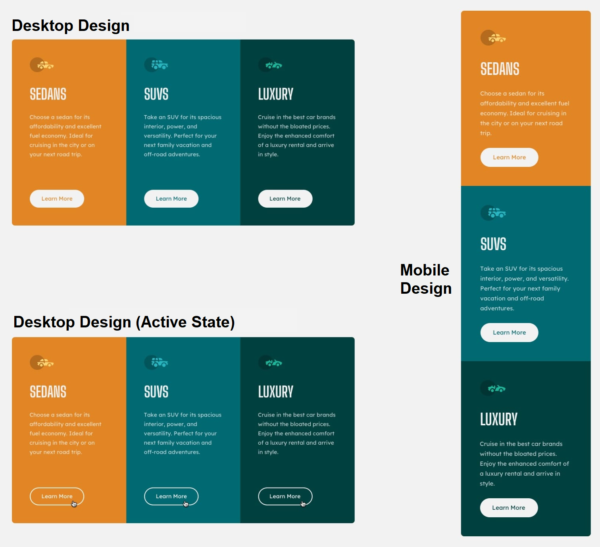

# 3-column preview card component solution

 

## Contents
- [Overview](#overview)
- [The challenge](#the-challenge)
- [My process](#my-process)
  - [Built with](#built-with)
  - [Additional work](#additional-work)
- [Links](#links)

 

## Overview
This is a solution to the [3-column preview card component challenge](https://www.frontendmentor.io/challenges/3column-preview-card-component-pH92eAR2-) on Frontend Mentor.

 

## The challenge

The challenge was to :
- Build out a 3-column preview card component as given above.
- Changing layout depending on the device's screen size of the user (desktop/mobile).
- Changing styling of buttons on hovering.

 

## My process

###  Built with
- Semantic HTML5 markup
- Custom CSS
- Flexbox
- Media Queries

### Additional Work
The challenge was to make webpage responsive for desktop view, and mobile view. However, I made it completely responsive for any screen size.

 

## Links
The website is deployed on Github Pages.

- Live Site URL : [live site](https://pranav-rustagi.github.io/3-column-preview-card-component)
- Frontend Mentor solution URL : [frontend mentor solution](https://www.frontendmentor.io/solutions/flexbox-custom-css-responsiveness-google-fonts-Cr2iqrN4h)
