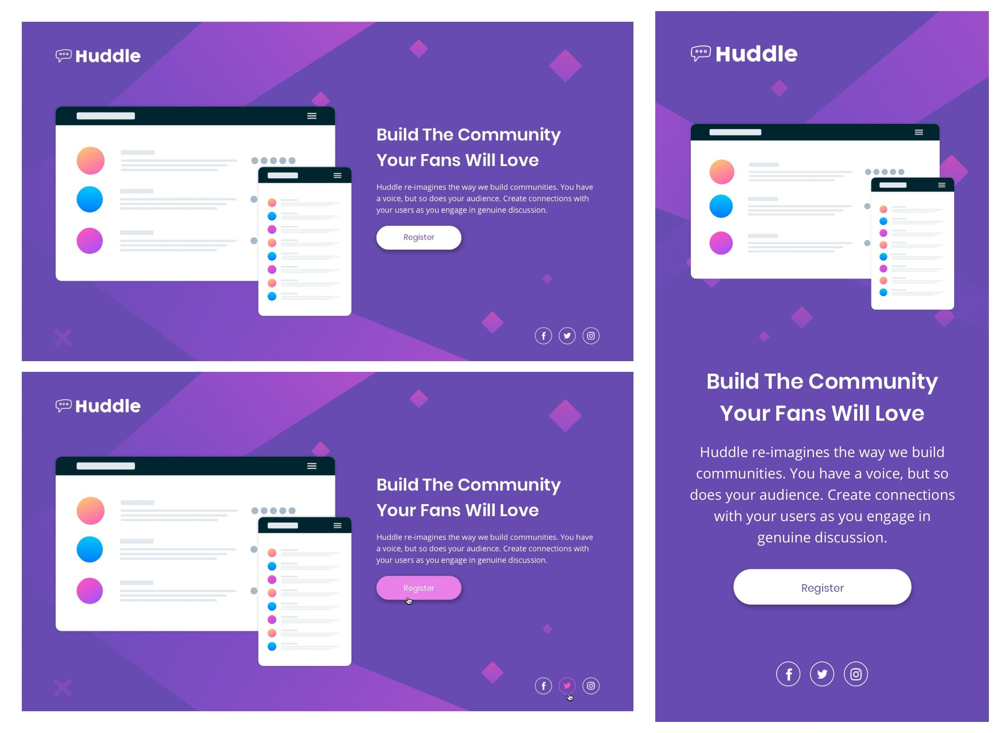

# profile card component solution

 

## Contents
- [Overview](#overview)
- [The challenge](#the-challenge)
- [Built with](#built-with)
- [Links](#links)

 

## Overview
This is a solution to the [Huddle Landing Page With A Single Introductory Section Challenge](https://www.frontendmentor.io/challenges/huddle-landing-page-with-a-single-introductory-section-B_2Wvxgi0) on [Frontend Mentor](https://www.frontendmentor.io).

 

## The challenge

The challenge was to :
- Build build out a landing page from the designs provided.
- Changing layout depending on the device's screen size of the user (desktop/mobile).
- Handle hover states for all interactive elements on the page.

 

##  Built with
- Semantic HTML5 markup
- Custom CSS
- CSS Flexbox
- Media Queries

 

## Links
The website is deployed on Github Pages.

- Live Site URL : [live site](https://pranav-rustagi.github.io/frontendmentorChallenges/huddle-landing-page-with-single-introductory-section)
- Frontend Mentor solution URL : [frontend mentor solution](https://www.frontendmentor.io/solutions/huddle-landing-page-with-a-single-introductory-section-rzQF0vD0U)
